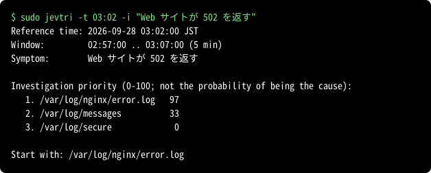

# Jev Triage (jevtri)

[English](README.md) | 日本語 | [简体中文](README.zh-CN.md)

jevtri（jev + triage）は、Linux サーバーの障害の**トリアージ**のための道具です。トリアージとは、
本格的な切り分けに入る前に、どこから調べるかを手早く決める初動の判断のことです。
jevtri は、最初にどのログを読むかを決める手助けをします。
設定したログから障害時刻の前後の行を集め、機密を伏せ字にしたうえで、
[Jev](https://docs.typesafe.ai) の API に各ログを調べる価値を判定させます。



数字は**調査優先度**で、そのログに原因がある確率ではありません。jevtri が示すのは
どこから調べ始めるかのおすすめです。原因の特定、復旧、サーバーの監視は行いません。
障害によっては、どのログにも痕跡が残りません。全てのログの値が低い場合は、その旨を示し、
設定していないログ、アプリケーション、ほかのホストを確かめるよう案内します。

結果の表示とエラーメッセージは英語です。

判定の例（試験で使ったログと、その結果）は[こちら](guide/examples.ja.md)、送る前の伏せ字の例は[こちら](guide/masking.ja.md)にあります。

## 導入

コマンド1行で入ります。

AlmaLinux、Rocky Linux、RHEL 8・9・10：

```sh
sudo dnf install https://github.com/takeshiue/jevtri/releases/download/v0.3.2/jevtri_0.3.2_x86_64.rpm
```

Ubuntu 22.04・24.04、Debian 12：

```sh
curl -fLO https://github.com/takeshiue/jevtri/releases/download/v0.3.2/jevtri_0.3.2_amd64.deb && sudo apt install ./jevtri_0.3.2_amd64.deb
```

arm64 のサーバーでは、`x86_64` を `aarch64` に、`amd64` を `arm64` に置き換えます。
ほかのファイルは[リリースのページ](https://github.com/takeshiue/jevtri/releases)にあります。

### 署名を確かめてから入れる

`SHA256SUMS` は鍵 `jevtri-signing-key.asc` で署名（`SHA256SUMS.asc`）しています。
`gpg --verify` が `Good signature` と、フィンガープリント
`EE2D 0814 C5CE 3F1F 76CE  4B2E B376 0451 3E19 3961` を表示することを確かめてから入れてください。

AlmaLinux、Rocky Linux、RHEL 8・9・10：

```sh
base=https://github.com/takeshiue/jevtri/releases/download/v0.3.2
curl -fL --remote-name-all $base/jevtri_0.3.2_x86_64.rpm $base/SHA256SUMS $base/SHA256SUMS.asc
curl -fsSL $base/jevtri-signing-key.asc | gpg --import
gpg --verify SHA256SUMS.asc SHA256SUMS
sha256sum -c --ignore-missing SHA256SUMS
sudo dnf install ./jevtri_0.3.2_x86_64.rpm
```

Ubuntu 22.04・24.04、Debian 12：

```sh
base=https://github.com/takeshiue/jevtri/releases/download/v0.3.2
curl -fL --remote-name-all $base/jevtri_0.3.2_amd64.deb $base/SHA256SUMS $base/SHA256SUMS.asc
curl -fsSL $base/jevtri-signing-key.asc | gpg --import
gpg --verify SHA256SUMS.asc SHA256SUMS
sha256sum -c --ignore-missing SHA256SUMS
sudo apt install ./jevtri_0.3.2_amd64.deb
```

### 対象と入るもの

パッケージは AlmaLinux 8・9・10、Ubuntu 22.04・24.04、Debian 12 を、
x86_64・arm64それぞれのネイティブ環境のコンテナで導入・動作・更新・削除試験しています。

パッケージが入れるのは `/usr/bin/jevtri`、`/usr/share/jevtri/` の設定の見本、man ページ、
`/etc/logrotate.d/jevtri` です。`/etc/jevtri/jevtri.conf` は入れません。そのサーバー向けの
設定は `jevtri init` が書きます。パッケージを削除しても、設定、API キー、送信記録は残ります。

### 実行に必要なパッケージ

RPM・debは `ca-certificates`、`logrotate`、`gzip`、`tzdata` を依存として指定します。
`apt`・`dnf`での導入時に揃います。CA証明書はHTTPS接続の検証、tzdataは
`Asia/Tokyo`などの時刻指定、logrotateとgzipは送信ログの回転・圧縮に使います。
日ごとの回転にはOSのlogrotate timerまたはcronが動いている必要があります。
コンテナへパッケージを入れるだけでは定期実行は始まりません。
この依存指定は0.3.2以降に含まれます。

## 初期設定

1. `sudo jevtri init` は、最初に Jev の API キーを尋ねます。貼り付けて Enter を押してください。
   キーは `/etc/jevtri/api-key`（root だけが読める `0600`）に保存されます。貼り間違いに気づけるよう、
   貼り付けたキーは画面に表示されます。Enter だけなら飛ばします。キーが無い場合や、
   権限が `0600` より緩い場合、jevtri は何も送りません。

2. 設定を書きます。

   ```sh
   sudo jevtri init
   ```

   `init` は、このサーバーにある既知のログ（`/var/log/messages`、`/var/log/nginx/error.log`、
   PostgreSQL や Tomcat のログなど）を一覧にします。番号で選ぶほか、`all` と入力すれば全候補を
   選べます（Enterだけでも全選択）。各ログの時刻の形式を末尾の行で確かめます。ほかのパスも追加できます。jevtri が時刻の形式を知らないログは、先頭の10行
   （伏せ字にしたもの）を Jev へ送って形式を判定させてよいか尋ねます。送った場合も、その形式で
   実際に行を読めたときだけ登録します。

   設定が無い状態で `jevtri` を実行すると、端末からなら `init` が始まり、端末でない場合
   （cron、systemd タイマー、パイプ）はエラーで終わります。

ログを読めるよう、jevtri は root で実行します。

## 使い方

```
jevtri [options]
jevtri init
jevtri --config-update
```

| オプション | 意味 |
|---|---|
| `-t`, `--time TIME` | 障害の時刻。`HH:MM[:SS]`（今日。未来になるなら前日）か `YYYY-MM-DD HH:MM[:SS]`。既定は現在 |
| `-m`, `--minutes N` | 見る範囲の分数。`-t` があればその前後、無ければ直前 N 分。既定は 5（設定の `minutes`） |
| `-i`, `--issue TEXT` | 症状。言語は問いません。例: `"Web サイトが 502 を返す"` |
| `-c`, `--config FILE` | 設定ファイル。既定は `/etc/jevtri/jevtri.conf` |
| `-v`, `--verbose` | 対象時間帯、ログごとの行数とバイト数、伏せ字の数、Jev の生の値も表示する |
| `-j`, `--json` | JSON で出力する。`priority` は 0〜1 の値 |
| `--dry-run` | 送る内容をそのまま表示し、何も送らない |
| `--lang LANG` | `--help` と `--show` の言語: `en`、`ja`、`zh-CN` |
| `--show` | 設定ファイルの場所と有効な設定を表示して終了する。ログやAPIキーを読まない。`--json` と `-c FILE` に対応 |
| `--group NAMES` | 指定グループ・`system`・グループ未設定のログを直接評価する。カンマ区切りで複数指定でき、繰り返し指定も可 |
| `--all-groups` | グループ選択を省略して、設定したすべてのログを直接評価する。`--group` との併用は不可 |
| `--config-update` | 設定にまだ無いログや Docker のコンテナを探し、1件ずつ尋ねる。`y` で追加、`all` でそれと残りすべてを追加、Enter で追加しない。コンテナやソフトを追加したら実行する |
| `--version`, `-h`, `--help` | 版数とヘルプ |

不要な登録は `jevtri --config-update` から削除できます。最後の登録ログ一覧で
番号・範囲・`all` を指定し、確認に `y` と答えてください。Enterや入力終了なら保持します。
ログがまだ存在する場合も登録対象から外せます。設定の保存後、対象パスを表示して
実ファイルも削除するか別途確認します。既定は削除しないで、明示的な `y` だけで
復元できない削除を行います。Enter・入力終了・`n` ならファイルを残します。
Docker管理のログ、共有ファイル、安全を確認できないパスは削除しません。
Docker管理のログはDocker側で管理してください。実ファイルの削除はLinuxでのみ対応し、
Dockerの探索に成功して管理対象との重複がないことも確認します。ファイルを残した場合は次回更新で
再び候補になることがありますが、同意せず再登録することはありません。

`jevtri --show` で設定ファイルの場所と登録ログを確認できます。
既定のファイルは `/etc/jevtri/jevtri.conf` です。別のファイルは
`jevtri --show -c /path/to/jevtri.conf`、JSON表示は `jevtri --show --json` を使います。
既定値を補った設定、グループ、時刻形式を表示します。追加マスクの式は
秘密文字列を含む場合があるため、内容の代わりに件数を表示します。
設定の更新やJevへの通信は行いません。

Docker Compose のログは **Composeプロジェクト単位** でグループ化します。
登録時に実際の `com.docker.compose.project` ラベルを読み、所属コンテナの
グループ候補にそのプロジェクト名を使います。アプリ名やディレクトリ名から推測しません。
グループ名に使えるのは半角英数字・`_`・`.`・`-` です。Compose を使わないコンテナは
コンテナ名、ホストのログは `system` が既定です。独自のグループも設定できるので、
すべてのグループが Compose プロジェクトとは限りません。

`init` と `--config-update` はコンテナごとの実際の json-file ログの絶対パスを
確認し、`path`・`docker_container`・`docker_project`・`time_format = docker-json`・
承認した `group` を保存します。通常実行では登録済みパスを読みます。コンテナの追加・
再作成、Docker の保存場所の変更、Compose プロジェクトの変更後は `--config-update` を
実行し、更新案を確認して登録してください。なくなったログの登録削除も確認します。

まず通常実行でグループを横断して調査対象を絞り、次に登録済みプロジェクト名を指定して
そのログを詳しく調べます。実際の Compose プロジェクト名が `shop` なら、次のように実行します。

```sh
sudo jevtri -i "Web サイトが 502 を返す"
sudo jevtri --group shop -i "Web サイトが 502 を返す"
```

0.3.0では、実行時に複数グループや全グループを指定できます。

```sh
sudo jevtri --group wordpress,database
sudo jevtri --group wordpress,database --group web
sudo jevtri --all-groups
```

設定済みのグループ名を指定します。名前の前後の空白は除きます。カンマの前後に
空白を書く場合は、`--group "wordpress, database"` のように引用符で囲んでください。
重複した名前は一度だけ扱います。`wordpress,,database` のような空の名前や不正な
名前はエラーになります。複数の指定グループに属する同じログも一度だけ評価します。

両方のオプションを省略した場合の自動選択は従来どおりです。時間帯に行のある
サービスグループが2つ以上なら、Jev が先にグループを評価し、最上位と得点差0.10以内の
グループのログに、`system`・グループ未設定のログを加えて評価します。どちらかを
指定した場合はグループ選択を省略します。対象時間帯・伏せ字・送信サイズ上限は適用します。

最初は `--dry-run` で、サーバーの外へ出る内容を確かめてください。

cron や systemd タイマーからも実行できます。`-t` が無いときは直前 `-m` 分を見るので、
間隔と揃えます。10分おきなら `-m 10` です。

### 終了コード

| コード | 意味 |
|---|---|
| 0 | 完了。時間帯に行のあるログが1つも無い場合も 0（何も送らない） |
| 1 | 設定や API キーの誤り、または読めるログが1つも無い。何も送らない |
| 2 | 完了したが、評価できなかったログがある（読めない、時刻が見つからない）。それらは順位を付けずに示す |
| 3 | Jev に接続できない、または要求を拒まれた。優先度は作らない |

## 実際の事例の報告

jevtri の判定を良くするため、作者は実際の障害の事例を集めています。ご協力をお願いします。

`jevtri report` 自体は**何も送りません**。報告のファイルを作るだけです。投稿するかどうかはあなたが決め、
投稿する場合は、内容を確かめたうえで、このリポジトリの GitHub Issue（誰でも読める公開の場所）へ
ご自身で貼り付けます。作者はその Issue を読み、判定の改善と試験に使います。

障害の本当の原因が分かったら、`sudo jevtri report` で、送信記録にあるその実行から
報告を作れます。実行と、本当の原因が出ていたログを選んでください。報告は送信記録と
同じ場所に `0600` で作られ、ホスト名、人のユーザー名（UID 1000 以上）、IP アドレスは `[host-1]` のような
記号に置き換わります。何も送りません。表示されるリンクの Issue フォームから投稿してください。
Issue は公開されるため、ほかのホスト名などは先に消してください。報告された事例は試験になり、
版ごとにそのうち何件を正しく並べられるかを公表します。

## 設定

`/etc/jevtri/jevtri.conf` は INI 形式です。誤りは行番号つきで示します。
`/usr/share/jevtri/jevtri.conf.example` も参照してください。

生成する設定の冒頭には、無効化した記載サンプルを入れます。`#` は行頭、または空白の後に書くと行末コメントになります。値そのものに ` #` を含める場合は、`path = "/srv/app #1/error.log"` のように値全体を引用符で囲んでください。設定更新でも利用者のコメントを保持します。検証済みのDockerパス・形式の変更は `all` でまとめて承認でき、未設定のグループも既定値の一覧を確認してまとめて登録できます。

```ini
[general]
minutes = 5
max_bytes = 40000
sent_log = /var/log/jevtri/sent.log

[log nginx-error]
path = /var/log/nginx/error.log
time_format = slash-ymd

[log tomcat]
path = /var/log/tomcat/catalina.*.log
time_format = dmy-month
timezone = Asia/Tokyo
read_compressed = yes
mask = order-\d+
```

| キー | 意味 |
|---|---|
| `minutes` | `-m` の既定値 |
| `max_bytes` | 各リクエストのJSON state全体のバイト数。ログの抜粋・名前・障害情報・JSONのエスケープを含む。抜粋の予算はログの間で分け、ERROR・WARN・failなどを含む行と障害時刻に近い行を優先して残す |
| `sent_log` | 実行ごとの記録を書く場所 |
| `path` | ログ。`*`・`?`・`[` でファイル名に日付の入ったログに一致させられる。時間帯がさかのぼる場合は回転済みのファイル（`.1`、`-20260928`）も読む |
| `docker_container` | `path` と併記するコンテナ名。登録・`--config-update`時に実在する json-file ログの絶対パスを検証して保存する。通常実行は保存したパスだけを読む。再作成後は設定更新が必要。登録時に `time_format = docker-json` も明記する |
| `docker_project` | 所属する Docker Compose のプロジェクト名。登録ではプロジェクトをまとめて選び、コンテナごとの `path`・`docker_container`・`group` を保存する。追加・再作成したコンテナは `--config-update` で確認して反映する |
| `journal_unit` | `path` の代わりに、`journalctl` で読む systemd のユニット（例: `docker.service`）。`*` は journal の全体。`time_format` は不要。`init` が `*` を候補に出すのは `/var/log/syslog` も `/var/log/messages` も無いサーバーだけ |
| `group` | ログが属するグループ。複数行で複数のグループに入れられる。`init` と `--config-update` は、ホストのログに `system`、Compose のプロジェクトにはプロジェクト名、ほかのコンテナにはコンテナ名を書く。書き換えや独自のグループの追加は自由 |
| `time_format` | 下の表の名前か、`%` 記号によるパターン |
| `timezone` | タイムゾーンの書かれていないログのタイムゾーン。既定はサーバーのもの |
| `read_compressed` | `yes` なら回転済みの `.gz` も読む |
| `mask` | 追加で伏せ字にする正規表現。同じログ設定に1行ずつ書いて複数指定する。[記載例](guide/masking.ja.md#additional-masks) |

時刻の形式。秒の小数部とタイムゾーン（`+09:00`、`Z`、`JST`）は有っても無くてもよく、
時刻は行のどこにあってもかまいません。

| 名前 | 例 |
|---|---|
| `syslog` | `Sep 28 07:51:24` |
| `rfc3339` | `2026-09-28T07:29:16.929554+09:00` |
| `iso-space` | `2026-09-28 03:03:07.591 JST` |
| `iso-comma` | `2026-09-28 15:47:01,123` |
| `slash-ymd` | `2026/09/28 03:02:04` |
| `apache-access` | `[28/Sep/2026:09:44:10 +0900]` |
| `apache-error` | `[Mon Sep 28 03:02:10.715837 2026]` |
| `dmy-month` | `28-Sep-2026 09:44:02.397` |
| `slash-mdy` | `09/28/2026 15:47:01` |
| `slash-dmy` | `28/09/2026 15:47:01` |
| `epoch` | `1790532211` |
| `docker-json` | `"time":"2026-10-01T10:00:05.987654321Z"`（Docker の json-file） |

時刻の無い行（スタックトレースなど）は、直前の行の続きとして扱います。

2つの高速化は、ログが古い順に時刻順で書かれていることを前提とします。8MiB を超える非圧縮のファイルでは、読み取りの開始位置を二分探索で探します。ファイル内で時刻が昇順に並ぶことが前提です。回転済みのファイルは更新日時の新しい順に読み、時間帯より古い行があったファイルで読むのをやめます。古いファイルほど古い時刻であることが前提です。新しい順に書くログ、時刻が乱れたログ、時刻の範囲が重なる回転済みのファイルでは、時間帯の記録を読み飛ばすことがあります。この欠落は、省略の警告に必ずしも表示されません。

1つのログで保持するテキストは、回転済みのファイルを合わせて 64MiB までです。超えた分は時刻の古いものから省き、警告を表示します。

登録済みのログファイルが見つからなければ、パスと調査対象に含められないことを示し、`--config-update`で設定を見直すよう案内します。ホストとコンテナのログに共通です。通常実行で追加コンテナを探索したり、設定を変更したりしません。

## 何をどこへ送るか

jevtri は TypeSafe のサービスである Jev（`https://api.typesafe.ai/v1/systemone`）へ
データを送ります。ほかへは接続しません。

- **通常の実行**では、時間帯に行のあるログごとに、そのパスと、伏せ字にした行
  （`max_bytes` の範囲内）を送ります。障害の時刻と、`-i` で渡した症状も送ります。行の中の時刻は
  1つのタイムゾーンの表記に揃えます。時間帯に行の無いログは送りません。
- **`jevtri init`** は、時刻の形式が分からないログの先頭10行を、伏せ字にしたうえで、
  同意を得た場合だけ送ります。
- **送る前に伏せ字にするもの:** パスワードなど `キー=値` 形式の秘密、トークン、
  `Authorization` ヘッダー、Cookie、秘密鍵のブロック、URL 中の認証情報、既知の形式のトークン、
  メールアドレスの `@` より前、カード番号、設定の `mask`。伏せ字はパターンによるため、
  見落とすことがあります。
- **伏せ字にしないもの:** IP アドレス、ホスト名、ユーザー名、パス、そのほか行に含まれる全て。
  `--dry-run` で確かめてください。
- **記録:** 各実行（`--dry-run` を含む）の送った内容と応答を、`/var/log/jevtri/sent.log`
  （root だけが読める `0600`）に追記します。API キーは記録しません。logrotate で30日分を残します。

TypeSafe の[プライバシーポリシー](https://typesafe.ai/legal/privacy-policy)（最終更新
2025-11-19、2026-09-27 に確認）によると、入力はモデルの学習・微調整に使われず、委託先を除いて
第三者へ開示されず、依頼に応じて削除されます。保存期間は「合理的に必要な期間」とだけ書かれて
おり、具体的な期間は分かりません。

Jev の料金は入力100万トークンあたり約 6.6 円（0.042 米ドル）で、出力は無料です
（[models](https://docs.typesafe.ai/models)、2026-09-28 に確認。1 米ドル = 157 円で換算）。
1回の実行は、送る量が既定の上限（40,000 バイト）いっぱいでも 1 円未満です。

## ソースからのビルド

Go の標準ライブラリだけを使っています。ビルドと試験にネットワークは要らず、試験は Jev へ
何も送りません。

```sh
go test ./...
CGO_ENABLED=0 go build -trimpath -ldflags "-X main.version=0.3.2" -o jevtri ./cmd/jevtri
```

## ヘルプとマニュアル

`jevtri --help` と `man jevtri` は英語・日本語・中国語（簡体字）に対応し、`LC_ALL`・
`LC_MESSAGES`・`LANG` で切り替わります。`jevtri --help --lang ja` のように指定もできます。
結果の表示とエラーメッセージは英語です。翻訳の修正を歓迎します。

## ライセンス

MIT。[LICENSE](LICENSE) を参照してください。
