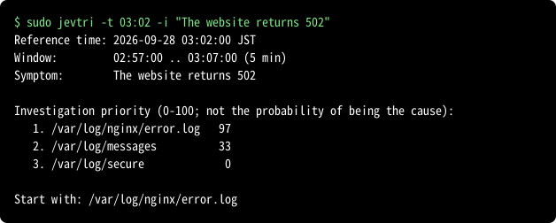

# Jev Triage (jevtri)

English | [日本語](README.ja.md) | [简体中文](README.zh-CN.md)

jevtri (jev + triage) is a tool for the **triage** of incidents on Linux servers: the quick
first decision on where to look, made before the real troubleshooting begins.
It helps you decide which log to read first.
It collects the lines around the incident time from the logs you configured, masks
secrets, and asks the [Jev](https://docs.typesafe.ai) API how worth investigating
each log is.



The number is an **investigation priority**, not the probability that a log holds
the cause. jevtri recommends where to start; it does not find the cause, fix
anything, or watch the server. Some failures leave no trace in any log. When every
log scores low, jevtri says so and suggests looking at logs that are not
configured, at the application, or outside the host.

See [examples](guide/examples.md) of test logs and how they were ranked, and an [example of masking](guide/masking.md) before sending.

## Install

One command:

AlmaLinux, Rocky Linux, RHEL 8, 9, 10:

```sh
sudo dnf install https://github.com/takeshiue/jevtri/releases/download/v0.3.2/jevtri_0.3.2_x86_64.rpm
```

Ubuntu 22.04, 24.04, Debian 12:

```sh
curl -fLO https://github.com/takeshiue/jevtri/releases/download/v0.3.2/jevtri_0.3.2_amd64.deb && sudo apt install ./jevtri_0.3.2_amd64.deb
```

On arm64 servers, replace `x86_64` with `aarch64` and `amd64` with `arm64`.
Other files are on the [releases page](https://github.com/takeshiue/jevtri/releases).

### Verify the signature first

`SHA256SUMS` is signed (`SHA256SUMS.asc`) with the key `jevtri-signing-key.asc`.
Check that `gpg --verify` prints `Good signature` and the fingerprint
`EE2D 0814 C5CE 3F1F 76CE  4B2E B376 0451 3E19 3961` before installing.

AlmaLinux, Rocky Linux, RHEL 8, 9, 10:

```sh
base=https://github.com/takeshiue/jevtri/releases/download/v0.3.2
curl -fL --remote-name-all $base/jevtri_0.3.2_x86_64.rpm $base/SHA256SUMS $base/SHA256SUMS.asc
curl -fsSL $base/jevtri-signing-key.asc | gpg --import
gpg --verify SHA256SUMS.asc SHA256SUMS
sha256sum -c --ignore-missing SHA256SUMS
sudo dnf install ./jevtri_0.3.2_x86_64.rpm
```

Ubuntu 22.04, 24.04, Debian 12:

```sh
base=https://github.com/takeshiue/jevtri/releases/download/v0.3.2
curl -fL --remote-name-all $base/jevtri_0.3.2_amd64.deb $base/SHA256SUMS $base/SHA256SUMS.asc
curl -fsSL $base/jevtri-signing-key.asc | gpg --import
gpg --verify SHA256SUMS.asc SHA256SUMS
sha256sum -c --ignore-missing SHA256SUMS
sudo apt install ./jevtri_0.3.2_amd64.deb
```

### Platforms and installed files

The packages are tested on AlmaLinux 8, 9 and 10, Ubuntu 22.04 and 24.04, and
Debian 12 on both x86_64 and arm64. Installation, execution, upgrade and removal
are checked in distribution containers on native runners for each architecture.

The package installs `/usr/bin/jevtri`, an example configuration in
`/usr/share/jevtri/`, the manual pages, and `/etc/logrotate.d/jevtri`. It does not install
`/etc/jevtri/jevtri.conf`: `jevtri init` writes it for your server. Removing the
package leaves your configuration, API key and send log in place.

### Runtime packages

RPM/deb packages declare `ca-certificates`, `logrotate`, `gzip`, and `tzdata`
as dependencies; `apt` or `dnf` installs them. CA certificates verify HTTPS
connections, tzdata supports named zones such as `Asia/Tokyo`, and logrotate
with gzip rotates and compresses the send log. Daily rotation requires the
OS logrotate timer or cron job to run. Installing the package in a container
does not start scheduled rotation. These dependencies are declared starting with version 0.3.2.

## Set up

1. `sudo jevtri init` starts by asking for your Jev API key: paste it and press
   Enter. It is stored in `/etc/jevtri/api-key` (root only, mode `0600`); the
   pasted key shows on the screen so that you can check it. Enter alone skips
   this step. jevtri sends nothing while the key is missing or its mode is
   looser than `0600`.

2. Write the configuration:

   ```sh
   sudo jevtri init
   ```

   `init` lists the known logs that exist on this server (for example
   `/var/log/messages`, `/var/log/nginx/error.log`, PostgreSQL and Tomcat logs),
   lets you pick them by number, or type `all` to select every candidate (Enter
   alone also selects all), and checks the time format of each against its last lines. You can add other paths. For a log whose time format jevtri does
   not know, it asks before sending the first 10 lines (masked) to Jev to identify
   the format, and only registers the answer if the lines really read that way.

   Running `jevtri` without a configuration starts `init` when it runs in a
   terminal, and fails otherwise (cron, systemd timers, pipes).

Run jevtri as root, so that it can read the logs.

## Use

```
jevtri [options]
jevtri init
jevtri --config-update
```

| Option | Meaning |
|---|---|
| `-t`, `--time TIME` | Incident time: `HH:MM[:SS]` (today, or yesterday if that is in the future) or `YYYY-MM-DD HH:MM[:SS]`. Default: now |
| `-m`, `--minutes N` | Minutes to look at: before and after `-t`, or the last N minutes without it. Default: 5 (`minutes` in the configuration) |
| `-i`, `--issue TEXT` | The symptom, in any language, e.g. `"The website returns 502"` |
| `-c`, `--config FILE` | Configuration file. Default: `/etc/jevtri/jevtri.conf` |
| `-v`, `--verbose` | Also show the window, lines and bytes per log, masked values, and Jev's raw answer |
| `-j`, `--json` | JSON output. `priority` is between 0 and 1 |
| `--dry-run` | Show exactly what would be sent, and send nothing |
| `--lang LANG` | Language of `--help` and `--show`: `en`, `ja` or `zh-CN` |
| `--show` | Show the selected configuration path and effective settings, then exit. Reads no logs or API key; supports `--json` and `-c FILE` |
| `--group NAMES` | Directly rank the named groups, `system` and ungrouped logs. Separate names with commas; the option can also be repeated |
| `--all-groups` | Skip group selection and directly rank all configured logs. Cannot be combined with `--group` |
| `--config-update` | Look for logs and Docker containers that are not in the configuration yet, and ask about each: `y` adds it, `all` adds it and the rest, Enter skips it. Run it after adding containers or software |
| `--version`, `-h`, `--help` | Version and help |

To remove unwanted registrations, run `jevtri --config-update`. At the final
registered-log list, select numbers, ranges or `all`, then confirm with `y`.
Enter or end of input keeps the registrations. Still-existing logs can also be
unregistered. After the configuration is saved, you can separately delete an
eligible log file: its path is shown and only `y` confirms permanent deletion.
Enter, end of input or `n` keeps the file. Docker-managed logs, shared files and
unsafe paths are protected; use Docker to manage its own logs. File deletion is
available on Linux and requires successful Docker discovery to check overlap. A retained file
may be offered again on the next update; adding it still requires consent.

Use `jevtri --show` to check the configuration file location and registered logs.
The default file is `/etc/jevtri/jevtri.conf`; use `jevtri --show -c /path/to/jevtri.conf`
for another file, or `jevtri --show --json` for JSON. The display includes effective
defaults, groups and time formats. Additional mask expressions are represented
by their count, because a rule can contain a secret. It does not update the
configuration or contact Jev.

Docker Compose logs are grouped **by Compose project**. At registration, jevtri
reads the actual `com.docker.compose.project` label and suggests that project
name as the group for its containers. It does not guess the project from an
application or directory name. A usable group name contains only ASCII letters,
digits, `_`, `.` or `-`. A standalone container uses its container name; host
logs use `system`. You can also set your own groups, so not every group is a
Compose project.

`init` and `--config-update` verify each container's actual absolute json-file
log path and save `path`, `docker_container`, `docker_project`,
`time_format = docker-json` and the approved `group`. Normal runs read the saved
paths. Run `--config-update` after adding or recreating containers, changing
Docker storage or changing Compose projects; review the proposed changes before
registration. The update also offers removal of registrations whose logs are gone.

Start with a normal run to narrow the investigation across groups, then use the
registered project name to examine its logs directly. For example, if the actual
Compose project is `shop`:

```sh
sudo jevtri -i "The website returns 502"
sudo jevtri --group shop -i "The website returns 502"
```

In 0.3.0, choose several groups or all groups at run time:

```sh
sudo jevtri --group wordpress,database
sudo jevtri --group wordpress,database --group web
sudo jevtri --all-groups
```

Group names must already be configured. Surrounding spaces are ignored; quote
names containing spaces around the commas, for example `--group "wordpress, database"`.
Repeated names are evaluated once. Empty names such as `wordpress,,database` and
invalid names are rejected. A log belonging to several selected groups is evaluated once.

Without either option, the existing automatic selection stays the same: when two
or more service groups have lines in the window, Jev first evaluates the groups,
then evaluates logs from the highest-scoring group and groups within 0.10 of its
score, together with `system` and ungrouped logs. With either option, group
selection is skipped; the time window, masking and send-size limit still apply.

Use `--dry-run` first to see what leaves the server.

jevtri can run from cron or a systemd timer. Without `-t` it looks at the last
`-m` minutes, so match the interval: every 10 minutes, use `-m 10`.

### Exit status

| Code | Meaning |
|---|---|
| 0 | Done. Also when no log has lines in the window (nothing is sent) |
| 1 | Configuration or API key error, or no log could be read. Nothing is sent |
| 2 | Done, but some logs could not be evaluated (unreadable, or no time found in them). They are listed and not ranked |
| 3 | Jev could not be reached or refused the request. No priorities are made up |

## Report a real case

To make jevtri rank better, the author collects real incidents. Your help is welcome.

`jevtri report` itself **sends nothing**; it only writes a report file. Whether to post it
is up to you. If you do, check it and paste it yourself into a GitHub issue in this
repository, which anyone can read. The author reads these issues and uses them to
improve the ranking and as tests.

When you have found the real cause of an incident, `sudo jevtri report` turns
that run from the send log into a report: choose the run and the log that
really showed the cause. The report is written next to the send log (0600),
with the host name, the user names of people (UID 1000 and above) and IP
addresses replaced by labels such as `[host-1]`.
Nothing is sent. Post it with the issue form whose link is printed; the issue
is public, so remove other host names and anything else first. Reported cases become
tests, and each release states how many of them it ranks correctly.

## Configuration

`/etc/jevtri/jevtri.conf` is an INI file. Errors are reported with the line number.
See `/usr/share/jevtri/jevtri.conf.example`.

Generated configuration starts with an inactive writing sample. Use `#` for a full-line comment or after whitespace for an end-of-line comment. Quote the whole value if it contains a literal ` #`, for example `path = "/srv/app #1/error.log"`. Updates keep your comments. Verified Docker path and format changes accept `all`; missing groups can be assigned together after reviewing their defaults.

```ini
[general]
minutes = 5
max_bytes = 40000
sent_log = /var/log/jevtri/sent.log

[log nginx-error]
path = /var/log/nginx/error.log
time_format = slash-ymd

[log tomcat]
path = /var/log/tomcat/catalina.*.log
time_format = dmy-month
timezone = Asia/Tokyo
read_compressed = yes
mask = order-\d+
```

| Key | Meaning |
|---|---|
| `minutes` | Default for `-m` |
| `max_bytes` | Bytes of the serialized JSON state in each request, including excerpts, source names, incident metadata and JSON escaping. The excerpt budget is shared among logs. Lines with ERROR, WARN, fail and similar words, and lines near the incident time, are kept first |
| `sent_log` | Where each run is recorded |
| `path` | The log. `*`, `?` and `[` match files with a date in their name. Rotated files (`.1`, `-20260928`) are read when the window reaches into them |
| `docker_container` | Container name alongside `path`. Registration and `--config-update` verify and save the actual absolute json-file log path. Normal runs read only the saved path; recreation requires a configuration update. Registration also writes `time_format = docker-json` explicitly |
| `docker_project` | Docker Compose project metadata. Select a project together at registration; each container has its own saved `path`, `docker_container` and `group`. Use `--config-update` to review and register added or recreated containers |
| `journal_unit` | Instead of `path`: a systemd unit read with `journalctl` (such as `docker.service`), or `*` for the whole journal. No `time_format` needed. `init` offers `*` only on a server without `/var/log/syslog` and `/var/log/messages` |
| `group` | A group the log is in; repeat the line for several groups. `init` and `--config-update` write `system` for logs on the host, the project for a Compose project, and its own name for another container. Change them or add your own. |
| `time_format` | A name from the table below, or a pattern with `%` directives |
| `timezone` | Time zone of a log written without one. Default: the server's |
| `read_compressed` | `yes` to read rotated `.gz` files too |
| `mask` | An extra regular expression to mask. Write one `mask` line per pattern in the same log section. See the [example](guide/masking.md#additional-masks) |

Time formats. Fractions of a second and a time zone (`+09:00`, `Z`, `JST`) may be
present or not, and the time may be anywhere in the line.

| Name | Example |
|---|---|
| `syslog` | `Sep 28 07:51:24` |
| `rfc3339` | `2026-09-28T07:29:16.929554+09:00` |
| `iso-space` | `2026-09-28 03:03:07.591 JST` |
| `iso-comma` | `2026-09-28 15:47:01,123` |
| `slash-ymd` | `2026/09/28 03:02:04` |
| `apache-access` | `[28/Sep/2026:09:44:10 +0900]` |
| `apache-error` | `[Mon Sep 28 03:02:10.715837 2026]` |
| `dmy-month` | `28-Sep-2026 09:44:02.397` |
| `slash-mdy` | `09/28/2026 15:47:01` |
| `slash-dmy` | `28/09/2026 15:47:01` |
| `epoch` | `1790532211` |
| `docker-json` | `"time":"2026-10-01T10:00:05.987654321Z"` (Docker json-file) |

Lines without a time (such as stack traces) belong to the line before them.

Two shortcuts assume that a log is written in time order, oldest first. In an uncompressed file larger than 8 MiB, the start of the window is found by binary search, which assumes the timestamps increase through the file. Rotated files are taken newest first by modification time, and reading stops after the first file that has a line older than the window, which assumes older files hold older times. In a log written newest first, with times out of order, or with rotated files whose times overlap, lines in the window may be skipped, and such omissions may not produce a warning.

At most 64 MiB of text is kept per log, across its rotated files. Beyond that the oldest entries by time are left out, and a warning says so.

If a registered file log is missing, jevtri reports its path, excludes it from the investigation and advises `--config-update`. This applies to host and container logs. Normal runs do not discover added containers or change configuration.

## What is sent, and where

jevtri sends data to Jev, a service of TypeSafe, at
`https://api.typesafe.ai/v1/systemone`. Nothing else is contacted.

- **A normal run** sends, for each log that has lines in the window: its path and
  those lines, after masking, within `max_bytes`; the incident time; and the
  symptom given with `-i`. Times in the lines are rewritten to one time zone.
  Logs without lines in the window are not sent.
- **`jevtri init`** sends the first 10 lines of a log whose time format it does
  not know, after masking, and only after you answer yes.
- **Masked before sending:** passwords and other `key=value` secrets, tokens,
  `Authorization` headers, cookies, private key blocks, credentials in URLs,
  known token formats, the local part of e-mail addresses, card numbers, and your
  `mask` patterns. Masking works by pattern and can miss things.
- **Not masked:** IP addresses, host names, user names, paths, and anything else
  in the lines. Check with `--dry-run`.
- **Recorded:** every run, including dry runs, is appended to
  `/var/log/jevtri/sent.log` (root only, `0600`) with what was sent and the answer.
  The API key is not recorded. logrotate keeps 30 days.

According to TypeSafe's [privacy policy](https://typesafe.ai/legal/privacy-policy)
(last updated 2025-11-19, read 2026-09-27), input is not used to train or fine-tune
models, is not disclosed to third parties other than service providers, and is
deleted on request. How long it is kept is not stated beyond "as long as
reasonably necessary".

Jev charges USD 0.042 per million input tokens, and output is free
([models](https://docs.typesafe.ai/models), 2026-09-28). One run costs well under
one US cent.

## Build from source

Only the Go standard library is used. Building and testing need no network, and
the tests send nothing to Jev.

```sh
go test ./...
CGO_ENABLED=0 go build -trimpath -ldflags "-X main.version=0.3.2" -o jevtri ./cmd/jevtri
```

## Help and manual

`jevtri --help` and `man jevtri` are in English, Japanese and Simplified Chinese,
chosen by `LC_ALL`, `LC_MESSAGES` or `LANG`; `jevtri --help --lang zh-CN` picks one.
Results and error messages are in English. Corrections to the translations are
welcome.

## License

MIT. See [LICENSE](LICENSE).

## Decision model benchmark

A separate Python benchmark compares Jev, Clef, and Clef-flash using identical synthetic logs. See the [benchmark guide](tools/decisionbench/README.md) (Japanese).
