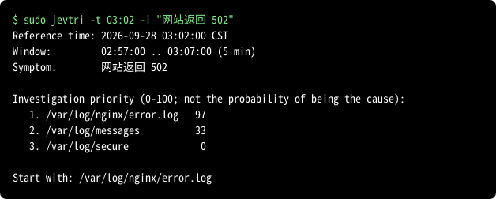

# Jev Triage (jevtri)

[English](README.md) | [日本語](README.ja.md) | 简体中文

jevtri（jev + triage）是用于 Linux 服务器故障**分诊（triage）**的工具。分诊是指在正式排查之前，
快速决定从哪里开始调查的初步判断。jevtri 帮助您决定首先阅读哪个日志。
它从已配置的日志中收集故障时间前后的日志行，对敏感信息进行脱敏，然后请
[Jev](https://docs.typesafe.ai) API 判断每个日志的调查价值。



这个数字是**调查优先级**，并不是该日志包含故障原因的概率。jevtri 只建议从哪里开始调查；
它不会查明原因、修复问题或监控服务器。有些故障不会在任何日志中留下痕迹。当所有日志的得分都很低时，
jevtri 会给出提示，并建议检查未配置的日志、应用程序本身或其他主机。

结果和错误信息以英文显示。

判断示例（测试所用日志及其结果）见[这里](guide/examples.zh-CN.md)，发送前的脱敏示例见[这里](guide/masking.zh-CN.md)。

## 安装

一条命令即可安装：

AlmaLinux、Rocky Linux、RHEL 8、9、10:

```sh
sudo dnf install https://github.com/takeshiue/jevtri/releases/download/v0.2.0/jevtri_0.2.0_x86_64.rpm
```

Ubuntu 22.04、24.04，Debian 12:

```sh
curl -fLO https://github.com/takeshiue/jevtri/releases/download/v0.2.0/jevtri_0.2.0_amd64.deb && sudo apt install ./jevtri_0.2.0_amd64.deb
```

在 arm64 服务器上，请将 `x86_64` 替换为 `aarch64`，将 `amd64` 替换为 `arm64`。
其他文件见[发布页面](https://github.com/takeshiue/jevtri/releases)。

### 先验证签名再安装

`SHA256SUMS` 使用密钥 `jevtri-signing-key.asc` 签名（`SHA256SUMS.asc`）。
请确认 `gpg --verify` 显示 `Good signature` 以及指纹
`EE2D 0814 C5CE 3F1F 76CE  4B2E B376 0451 3E19 3961` 后再安装。

AlmaLinux、Rocky Linux、RHEL 8、9、10:

```sh
base=https://github.com/takeshiue/jevtri/releases/download/v0.2.0
curl -fL --remote-name-all $base/jevtri_0.2.0_x86_64.rpm $base/SHA256SUMS $base/SHA256SUMS.asc
curl -fsSL $base/jevtri-signing-key.asc | gpg --import
gpg --verify SHA256SUMS.asc SHA256SUMS
sha256sum -c --ignore-missing SHA256SUMS
sudo dnf install ./jevtri_0.2.0_x86_64.rpm
```

Ubuntu 22.04、24.04，Debian 12:

```sh
base=https://github.com/takeshiue/jevtri/releases/download/v0.2.0
curl -fL --remote-name-all $base/jevtri_0.2.0_amd64.deb $base/SHA256SUMS $base/SHA256SUMS.asc
curl -fsSL $base/jevtri-signing-key.asc | gpg --import
gpg --verify SHA256SUMS.asc SHA256SUMS
sha256sum -c --ignore-missing SHA256SUMS
sudo apt install ./jevtri_0.2.0_amd64.deb
```

### 支持的平台和安装的文件

软件包已在 x86_64 的 AlmaLinux 8、9、10，Ubuntu 22.04、24.04 和 Debian 12 上测试。
arm64 软件包以相同方式构建，但尚未在 arm64 服务器上测试。

软件包会安装 `/usr/bin/jevtri`、`/usr/share/jevtri/` 中的配置示例、手册页以及
`/etc/logrotate.d/jevtri`。它不会安装 `/etc/jevtri/jevtri.conf`：该文件由 `jevtri init`
根据您的服务器生成。卸载软件包后，配置、API 密钥和发送记录会保留。

## 初始设置

1. `sudo jevtri init` 首先会询问 Jev API 密钥：粘贴后按 Enter。密钥保存在
   `/etc/jevtri/api-key`（仅 root 可读，权限 `0600`）；为便于发现粘贴错误，粘贴的密钥会显示在屏幕上。
   只按 Enter 则跳过。密钥不存在或权限比 `0600` 更宽松时，jevtri 不会发送任何内容。

2. 生成配置：

   ```sh
   sudo jevtri init
   ```

   `init` 会列出本服务器上存在的已知日志（例如 `/var/log/messages`、
   `/var/log/nginx/error.log`、PostgreSQL 和 Tomcat 的日志）。可按编号选择，或输入 `all`
   选择所有候选项（只按 Enter 也会全选），并根据每个日志的最后几行确认其时间格式。也可以添加其他路径。对于 jevtri 不认识时间格式的日志，
   它会先征求您的同意，再将前 10 行（已脱敏）发送给 Jev 以判断格式；只有当日志行确实能按该格式读取时才会登记。

   在没有配置的情况下运行 `jevtri` 时，如果在终端中运行则会启动 `init`，
   否则（cron、systemd 定时器、管道）以错误结束。

请以 root 身份运行 jevtri，以便读取日志。

## 使用方法

```
jevtri [options]
jevtri init
jevtri --config-update
```

| 选项 | 含义 |
|---|---|
| `-t`, `--time TIME` | 故障时间：`HH:MM[:SS]`（今天；如果在未来则为昨天）或 `YYYY-MM-DD HH:MM[:SS]`。默认为当前时间 |
| `-m`, `--minutes N` | 查看范围的分钟数：指定 `-t` 时为其前后，未指定时为最近 N 分钟。默认为 5（配置中的 `minutes`） |
| `-i`, `--issue TEXT` | 症状，任何语言均可，例如 `"网站返回 502"` |
| `-c`, `--config FILE` | 配置文件。默认为 `/etc/jevtri/jevtri.conf` |
| `-v`, `--verbose` | 同时显示时间范围、每个日志的行数和字节数、脱敏数量以及 Jev 的原始结果 |
| `-j`, `--json` | 以 JSON 格式输出。`priority` 为 0 到 1 之间的值 |
| `--dry-run` | 显示将要发送的内容，但不发送任何内容 |
| `--lang LANG` | `--help` 和 `--show` 的语言：`en`、`ja` 或 `zh-CN` |
| `--show` | 显示所选配置文件的路径及有效设置后退出。不读取日志或 API 密钥；支持 `--json` 和 `-c FILE` |
| `--group NAMES` | 直接评估指定组、`system` 和未分组的日志。组名用逗号分隔，也可重复指定 |
| `--all-groups` | 跳过组选择，直接评估所有已配置的日志。不能与 `--group` 同时使用 |
| `--config-update` | 查找配置中尚未包含的日志和 Docker 容器，并逐个询问：`y` 添加，`all` 添加该项及其后全部，按 Enter 不添加。添加容器或软件后运行 |
| `--version`, `-h`, `--help` | 版本和帮助 |

用 `jevtri --config-update` 删除不需要的注册项。在最后的已注册日志列表中
选择编号、范围或 `all`，再输入 `y` 确认。按 Enter 或结束输入会保留注册项。
日志仍存在时也可取消注册。保存配置后，另行显示路径并询问是否永久删除
符合安全条件的日志文件。默认不删除，只有明确输入 `y` 才删除，无法恢复。
按 Enter、结束输入或输入 `n` 会保留文件。Docker管理的日志、共享文件和
无法确认安全的路径不会删除；Docker日志应由Docker管理。文件删除只支持Linux，
且必须成功查询Docker以确认没有重叠。保留的文件可能在
下次更新时再次成为候选，但未经同意不会重新注册。

用 `jevtri --show` 查看配置文件的位置和已注册的日志。
默认文件为 `/etc/jevtri/jevtri.conf`。使用 `jevtri --show -c /path/to/jevtri.conf`
查看其他文件，或使用 `jevtri --show --json` 输出 JSON。显示内容包括有效默认值、
组及时间格式。附加脱敏表达式可能含有秘密信息，因此只显示规则数量。
此操作不会更新配置，也不会连接 Jev。

Docker Compose 日志**按 Compose 项目分组**。注册时，jevtri 读取实际的
`com.docker.compose.project` 标签，并将该项目名作为所属容器的组名候选；不会根据
应用名或目录名猜测。组名只能包含 ASCII 字母、数字、`_`、`.` 或 `-`。
独立容器默认使用容器名，主机日志默认使用 `system`。也可以设置自定义组，
因此并非所有组都是 Compose 项目。

`init` 和 `--config-update` 验证每个容器实际的 json-file 日志绝对路径，
保存 `path`、`docker_container`、`docker_project`、`time_format = docker-json`
和已确认的 `group`。正常运行读取已注册的路径。添加或重新创建容器、更改 Docker
存储位置或更改 Compose 项目后，请运行 `--config-update`，查看更新建议后注册。
更新也会询问是否删除日志已不存在的注册项。

先正常运行，跨组缩小调查范围；再指定已注册的项目名，详细检查该项目的日志。
例如，实际的 Compose 项目名为 `shop` 时：

```sh
sudo jevtri -i "网站返回 502"
sudo jevtri --group shop -i "网站返回 502"
```

在 0.3.0 中，可在运行时指定多个组或所有组：

```sh
sudo jevtri --group wordpress,database
sudo jevtri --group wordpress,database --group web
sudo jevtri --all-groups
```

请使用已配置的组名。组名前后的空格会被忽略；在逗号前后使用空格时，请加引号，
例如 `--group "wordpress, database"`。重复的组名只处理一次。
`wordpress,,database` 等包含空组名的写法以及无效组名会报错。
同时属于多个指定组的同一日志也只评估一次。

两种选项均未指定时，自动选择规则保持不变：如果时间范围内有日志行的服务组有两个
以上，Jev 会先评估各组，再评估最高分组以及与最高分相差不超过 0.10 的组中的日志，
同时包含 `system` 和未分组的日志。使用其中任一选项时，跳过组选择；时间范围、脱敏
和发送大小限制仍然适用。

请先使用 `--dry-run` 确认哪些内容会离开服务器。

jevtri 可以通过 cron 或 systemd 定时器运行。不指定 `-t` 时，它查看最近 `-m` 分钟，
因此请与运行间隔保持一致：每 10 分钟运行一次时，使用 `-m 10`。

### 退出状态

| 代码 | 含义 |
|---|---|
| 0 | 完成。时间范围内没有任何日志有日志行时也为 0（不发送任何内容） |
| 1 | 配置或 API 密钥错误，或没有可读取的日志。不发送任何内容 |
| 2 | 完成，但有部分日志无法评估（无法读取，或找不到时间）。这些日志会列出但不参与排序 |
| 3 | 无法连接 Jev，或请求被拒绝。不会编造优先级 |

## 报告真实案例

为了改进 jevtri 的判断，作者正在收集真实的故障案例，欢迎您的协助。

`jevtri report` 本身**不发送任何内容**，只生成报告文件。是否提交由您决定。如果提交，请先检查内容，
再由您自己粘贴到本仓库的 GitHub Issue（任何人都能阅读的公开位置）。作者会阅读这些 Issue，
用于改进排序和作为测试。

找到故障的真正原因后，可以用 `sudo jevtri report` 将发送记录中的那次运行生成报告：
选择该次运行以及真正显示原因的日志。报告以 `0600` 写在发送记录旁边，主机名、个人用户名（UID 1000 及以上）和 IP 地址会被
替换为 `[host-1]` 之类的标记。不发送任何内容。请通过显示的链接中的 Issue 表单提交；Issue
是公开的，请先删除其他主机名等内容。报告的案例会成为测试，每个版本都会公布其中有多少被正确排序。

## 配置

`/etc/jevtri/jevtri.conf` 为 INI 文件，错误会带行号报告。
另请参阅 `/usr/share/jevtri/jevtri.conf.example` 和 `man jevtri`。

生成的配置在开头包含已注释的填写示例。`#` 可用于整行注释，也可在空白后用于行末注释。如果值本身含有 ` #`，请用引号包住整个值，例如 `path = "/srv/app #1/error.log"`。更新会保留用户注释。已验证的 Docker 路径和格式变更可用 `all` 一次确认；未设置的组也可在查看默认值列表后一起登记。

```ini
[general]
minutes = 5
max_bytes = 40000
sent_log = /var/log/jevtri/sent.log

[log nginx-error]
path = /var/log/nginx/error.log
time_format = slash-ymd

[log tomcat]
path = /var/log/tomcat/catalina.*.log
time_format = dmy-month
timezone = Asia/Shanghai
read_compressed = yes
mask = order-\d+
```

| 键 | 含义 |
|---|---|
| `minutes` | `-m` 的默认值 |
| `max_bytes` | 每次请求的序列化 JSON state 的总字节数，包括日志片段、来源名称、故障信息及 JSON 转义。日志片段的预算在各日志之间分配，优先保留包含 ERROR、WARN、fail 等词的行及接近故障时间的行 |
| `sent_log` | 记录每次运行的位置 |
| `path` | 日志文件。可用 `*`、`?`、`[` 匹配文件名中带日期的日志。当时间范围回溯到已轮转的文件（`.1`、`-20260928`）时也会读取 |
| `docker_container` | 与 `path` 同时填写的容器名称。注册和 `--config-update` 会验证并保存实际 json-file 日志的绝对路径。正常运行只读取已保存的路径；重新创建后需要更新配置。注册时也明确写入 `time_format = docker-json` |
| `docker_project` | Docker Compose 项目的标识信息。注册时整体选择项目，为每个容器保存 `path`、`docker_container` 和 `group`。新增或重新创建的容器通过 `--config-update` 确认并注册 |
| `journal_unit` | 代替 `path`：用 `journalctl` 读取的 systemd 单元（例如 `docker.service`），`*` 表示整个 journal。无需 `time_format`。仅在既没有 `/var/log/syslog` 也没有 `/var/log/messages` 的服务器上，`init` 才会列出 `*` |
| `group` | 日志所属的组；写多行即可属于多个组。`init` 和 `--config-update` 为主机日志写入 `system`，为容器写入 Docker Compose 项目名（非 Compose 则为容器名）。可修改或自建组 |
| `time_format` | 下表中的名称，或使用 `%` 指令的模式 |
| `timezone` | 未写明时区的日志所使用的时区。默认为服务器的时区 |
| `read_compressed` | 设为 `yes` 时也读取已轮转的 `.gz` 文件 |
| `mask` | 额外脱敏的正则表达式。在同一日志配置中，每行写一个 `mask`。参见[示例](guide/masking.zh-CN.md#additional-masks) |

时间格式。秒的小数部分和时区（`+08:00`、`Z`、`CST`）可有可无，时间可以出现在行中的任何位置。

| 名称 | 示例 |
|---|---|
| `syslog` | `Sep 28 07:51:24` |
| `rfc3339` | `2026-09-28T07:29:16.929554+09:00` |
| `iso-space` | `2026-09-28 03:03:07.591 JST` |
| `iso-comma` | `2026-09-28 15:47:01,123` |
| `slash-ymd` | `2026/09/28 03:02:04` |
| `apache-access` | `[28/Sep/2026:09:44:10 +0900]` |
| `apache-error` | `[Mon Sep 28 03:02:10.715837 2026]` |
| `dmy-month` | `28-Sep-2026 09:44:02.397` |
| `slash-mdy` | `09/28/2026 15:47:01` |
| `slash-dmy` | `28/09/2026 15:47:01` |
| `epoch` | `1790532211` |
| `docker-json` | `"time":"2026-10-01T10:00:05.987654321Z"`（Docker json-file） |

没有时间的行（例如堆栈跟踪）视为上一行的延续。

有两项加速处理假定日志按时间顺序（从旧到新）写入。对于大于 8 MiB 的未压缩文件，使用二分查找确定读取起始位置，这假定文件内的时间戳按升序排列。已轮转的文件按修改时间从新到旧读取，在遇到含有早于时间范围的行的文件后停止读取，这假定越旧的文件包含越早的时间。对于倒序写入、时间戳顺序混乱或已轮转文件时间范围重叠的日志，可能会跳过时间范围内的记录，这种遗漏不一定会触发截断警告。

每个日志（包括其已轮转的文件）最多保留 64 MiB 的文本。超出部分按时间从旧到新省略，并显示警告。

如果已注册的日志文件不存在，jevtri 会显示路径、说明无法将其纳入调查，并提示使用 `--config-update` 检查配置。此规则适用于主机和容器日志。正常运行不会查找新增容器或修改配置。

## 发送哪些数据，发送到哪里

jevtri 只向 TypeSafe 提供的服务 Jev（`https://api.typesafe.ai/v1/systemone`）发送数据，
不连接其他任何地方。

- **正常运行**时，对于时间范围内有日志行的每个日志，发送其路径和脱敏后的日志行
  （在 `max_bytes` 范围内），以及故障时间和通过 `-i` 给出的症状。日志行中的时间会统一改写为同一时区的表示。
  时间范围内没有日志行的日志不会发送。
- **`jevtri init`** 仅在征得您的同意后，发送时间格式未知的日志的前 10 行（已脱敏）。
- **发送前脱敏的内容：** 密码等 `key=value` 形式的机密、令牌、`Authorization` 头、Cookie、
  私钥块、URL 中的凭据、已知格式的令牌、电子邮件地址中 `@` 之前的部分、银行卡号，以及您配置的
  `mask`。脱敏基于模式匹配，可能会有遗漏。
- **不会脱敏的内容：** IP 地址、主机名、用户名、路径，以及日志行中的其他所有内容。
  请用 `--dry-run` 确认。
- **记录：** 每次运行（包括 `--dry-run`）发送的内容和响应都会追加到
  `/var/log/jevtri/sent.log`（仅 root 可读，`0600`）。API 密钥不会被记录。logrotate 保留 30 天。

根据 TypeSafe 的[隐私政策](https://typesafe.ai/legal/privacy-policy)（最后更新于
2025-11-19，于 2026-09-27 查阅），输入不会用于训练或微调模型，除服务提供商外不会向第三方披露，
并可应要求删除。保存期限仅写明为“合理必要的期限”，没有具体说明。

Jev 的费用为每百万输入令牌约 0.28 元人民币（0.042 美元），输出免费
（[models](https://docs.typesafe.ai/models)，2026-09-28 查阅；按 1 美元 = 6.70 元人民币换算）。
即使发送量达到默认上限（40,000 字节），一次运行的费用也不到 0.02 元人民币。

## 帮助和手册

`jevtri --help` 和 `man jevtri` 提供英文、日文和简体中文版本，根据 `LC_ALL`、`LC_MESSAGES`
或 `LANG` 切换；也可以用 `jevtri --help --lang zh-CN` 指定。结果和错误信息为英文。
中文翻译无法由开发者完全确认，欢迎指正。

## 从源代码构建

仅使用 Go 标准库。构建和测试不需要网络，测试不会向 Jev 发送任何内容。

```sh
go test ./...
CGO_ENABLED=0 go build -trimpath -ldflags "-X main.version=0.3.0" -o jevtri ./cmd/jevtri
```

## 许可证

MIT。请参阅 [LICENSE](LICENSE)。
